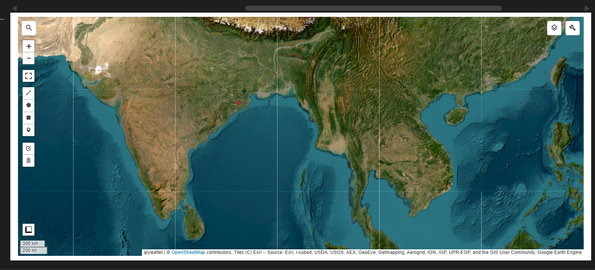
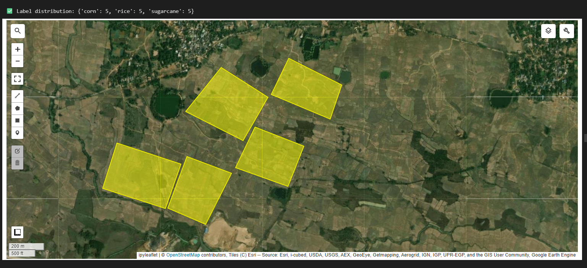
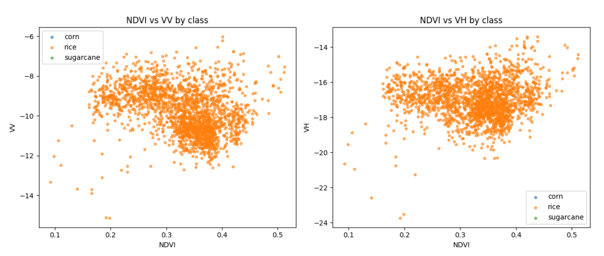
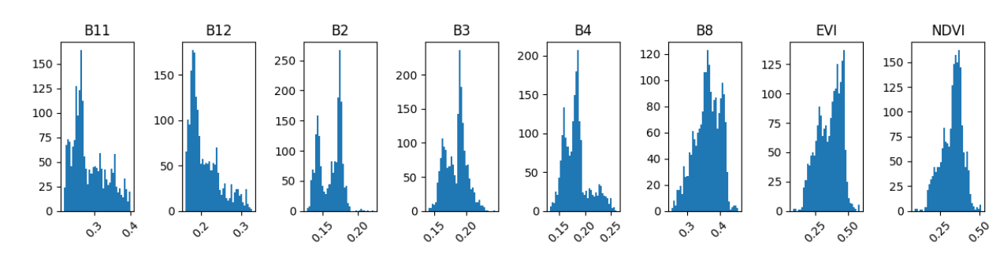
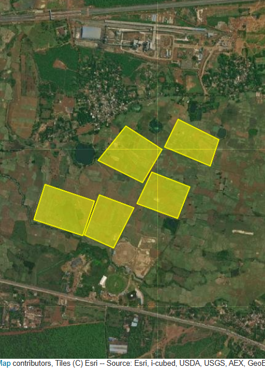
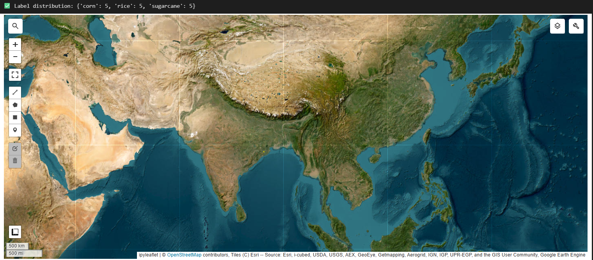
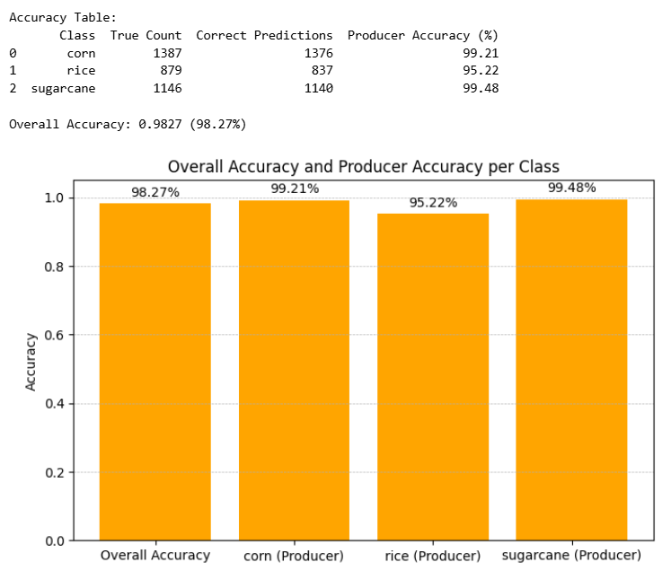

# 🌾 Crop Classification

A satellite-based crop classification project using **Sentinel-1, Sentinel-2, Python, and Google Earth Engine (GEE)** to work with satellite imagery, geospatial data, and agricultural training samples.

## 📌 About the Project

This project explores the use of satellite imagery and geospatial data for agricultural analysis and crop classification.

**Sentinel-1** and **Sentinel-2** satellite data are accessed and processed using **Google Earth Engine**, while Python scripts and Jupyter Notebooks are used for data preparation, testing, and analysis.

## 🛰️ Data Sources

### Sentinel-1

Sentinel-1 provides **Synthetic Aperture Radar (SAR)** data that can be used for monitoring Earth's surface and agricultural areas.

### Sentinel-2

Sentinel-2 provides **multispectral optical imagery** that is useful for vegetation and agricultural land analysis.

## 🌍 Google Earth Engine

Google Earth Engine is used to work with satellite imagery and geospatial datasets.

The project includes workflows for:

* Accessing satellite imagery
* Selecting geographical regions
* Processing satellite data
* Creating geographical training samples
* Preparing data for crop classification

## 🔄 Project Workflow

```text
Satellite Imagery
       ↓
Google Earth Engine
       ↓
Sentinel-1 + Sentinel-2
       ↓
Geographical Training Samples
       ↓
Data Preparation
       ↓
Crop Classification Workflow
```

## 🗺️ Training Data

The project uses **GeoJSON** files to store geographical features and training samples.

Important files include:

* `training_samples.geojson`
* `training_samples_fixed.geojson`
* `my_drawn_features.geojson`
* `_tmp_rice_one.geojson`

## 🛠️ Technologies Used

* **Python**
* **Google Earth Engine**
* **Sentinel-1**
* **Sentinel-2**
* **GeoJSON**
* **Jupyter Notebook**
* **Git & GitHub**

## 📂 Project Structure

```text
Crop-Classification/
│
├── Untitled.ipynb
├── Untitled1.ipynb
├── Untitled2.ipynb
├── Untitled3.ipynb
├── Untitled4.ipynb
├── Untitled5.ipynb
│
├── create_training_data.py
├── gee.py
├── test_dataset.py
├── test_gee.py
│
├── training_samples.geojson
├── training_samples_fixed.geojson
├── my_drawn_features.geojson
├── _tmp_rice_one.geojson
│
└── screenshots/
    ├── 1.png
    ├── 2.png
    ├── 3.png
    ├── 4.png
    ├── 5.png
    ├── 6.png
    └── 7.png
```

## 📷 Project Screenshots

### Image 1



### Image 2



### Image 3



### Image 4



### Image 5



### Image 6



### Image 7



## 🎯 Project Objectives

* Work with satellite imagery for agricultural analysis
* Explore Sentinel-1 and Sentinel-2 datasets
* Use Google Earth Engine for geospatial processing
* Create and manage geographical training samples
* Prepare data for crop classification
* Gain practical experience with remote sensing and geospatial data

## 💡 Applications

Crop classification using satellite data can be useful for:

* Agricultural monitoring
* Crop mapping
* Land-use analysis
* Agricultural planning
* Crop-area estimation
* Remote sensing applications

## 🔮 Future Enhancements

* Implement machine-learning-based crop classification
* Compare different classification algorithms
* Add vegetation indices such as NDVI
* Combine Sentinel-1 and Sentinel-2 features
* Improve training-data quality
* Add accuracy assessment
* Generate a confusion matrix
* Visualize classification results on maps
* Build an agricultural analytics dashboard

## 📚 Learning Outcomes

This project provided practical exposure to:

* Satellite imagery
* Remote sensing
* Google Earth Engine
* Geospatial data processing
* GeoJSON
* Python
* Jupyter Notebooks
* Agricultural data analysis
* Training-data preparation

## 👨‍💻 Author

**Vijit Kumar**

B.Tech – Computer Science & Engineering

**GitHub:**
https://github.com/vijitkumar07

## ⚠️ Disclaimer

This project is developed for educational and research purposes. Crop classification results depend on the quality of satellite imagery, training samples, preprocessing techniques, and classification methods used.
